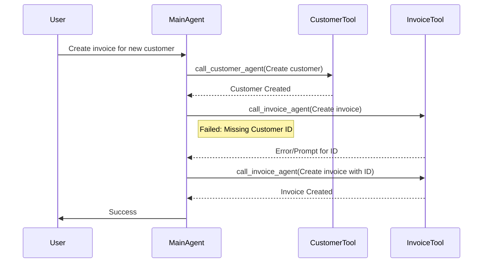
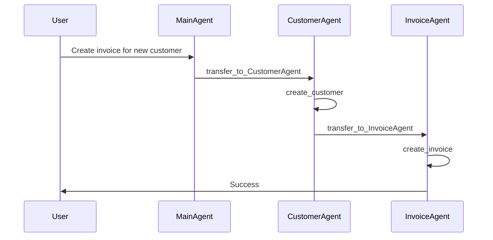
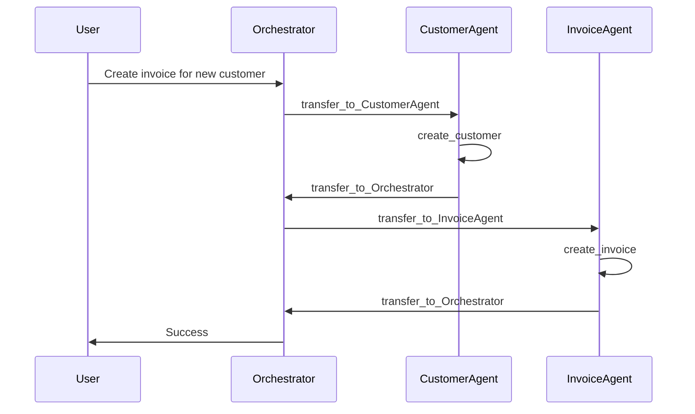

# Multi-Agent Approach Comparison

Based on the execution traces in [ai_execution_history_data.md](ai_execution_history_data.md), here is a comparative analysis of the three architectures.

## Overview of Approaches

1.  **Agent as Tool**
    *   **Branch**: `multi_turns/agent_as_tool`
    *   **Concept**: The Main Agent calls tools directly (including other agents wrapped as tools).
2.  **Multi-Agents (Mesh/Know Others)**
    *   **Branch**: `multi_turns/multi_agents_know_others`
    *   **Concept**: Agents can transfer control directly to other specific agents.
3.  **Multi-Agents (Hub & Spoke)**
    *   **Branch**: `multi_turns/multi_agents`
    *   **Concept**: Agents must return control to the Main Agent (Orchestrator), which then delegates to the next agent.

## 1. Call Flow Diagrams

### Approach 1: Agent as Tool (`multi_turns/agent_as_tool`)
The Main Agent acts as the single brain, calling "Agent Tools" as functions. It handles the logic and data passing between them.

### Approach 2: Multi-Agents Mesh (`multi_turns/multi_agents_know_others`)
Agents hand off directly to each other. The `CustomerAgent` knows that `InvoiceAgent` exists and transfers control directly.

### Approach 3: Multi-Agents Hub & Spoke (`multi_turns/multi_agents`)
Strict separation. Agents only know the Orchestrator. Every handoff goes through the center.

## 2. Quantitative Metrics

| Metric | Agent as Tool | Multi-Agents (Mesh) | Multi-Agents (Hub & Spoke) |
| :--- | :--- | :--- | :--- |
| **Total Tokens** | **1,521** (Lowest) | 2,346 (~1.5x) | 4,048 (~2.7x) |
| **Input Tokens** | 1,208 | 2,148 | 3,794 |
| **Output Tokens** | 313 | 198 | 254 |
| **Model Round Trips** | ~3 | ~4 | ~6 |
| **Est. Latency** | Low | Medium | High |

### Key Observations:
*   **Efficiency**: "Agent as Tool" is significantly more token-efficient (40% less than Mesh, 62% less than Hub & Spoke). This is likely because the context stays in one place and doesn't need to be re-summarized or passed around with full history overhead in every handoff.
*   **Latency (Turns)**:
    *   **Agent as Tool**: The model attempted to parallelize the calls (`create_customer` and `create_invoice`). While this failed due to a missing ID dependency (requiring a self-correction step), it shows the potential for speed. Even with the correction, it finished in fewer steps.
    *   **Hub & Spoke**: The "ping-pong" effect (Main -> Agent -> Main -> Agent) drastically increases the number of turns and tokens. Every intermediate step goes through the Orchestrator.

## 3. Qualitative Analysis

### Approach 1: Agent as Tool
*   **Mechanism**: Main agent sees all tools and decides execution flow.
*   **Pros**:
    *   **Global Context**: The Main agent has full visibility of the conversation and state, making it easier to handle dependencies (once corrected).
    *   **Cost Effective**: Lowest token usage.
*   **Cons**:
    *   **Complexity Limit**: As the number of tools grows, the Main agent's system prompt and context window can get overwhelmed.
    *   **Hallucination Risk**: As seen in the trace, the model tried to call `create_invoice` before `create_customer` returned an ID. It assumed it could do both in parallel, which failed.

### Approach 2: Multi-Agents (Mesh / Know Others)
*   **Mechanism**: `CustomerAgent` explicitly transfers to `InvoiceAgent`.
*   **Pros**:
    *   **Direct Handoff**: More efficient than Hub & Spoke. The `CustomerAgent` knows that after creating a customer, the next logical step (if requested) is the `InvoiceAgent`.
*   **Cons**:
    *   **Tight Coupling**: `CustomerAgent` needs to know about `InvoiceAgent`. If you add a `ShippingAgent`, you might need to update `CustomerAgent`'s definitions. This reduces modularity.

### Approach 3: Multi-Agents (Hub & Spoke)
*   **Mechanism**: `CustomerAgent` does its job and returns to `Orchestrator`. `Orchestrator` then calls `InvoiceAgent`.
*   **Pros**:
    *   **Decoupling**: Specialists are purely focused on their domain. They don't know who else exists.
    *   **Scalability**: Easier to add new agents without modifying existing specialists. Only the Orchestrator needs to be updated.
*   **Cons**:
    *   **Overhead**: Significant penalty in tokens and latency due to the intermediate hops back to the Orchestrator.
    *   **Context Loss Risk**: The Orchestrator needs to maintain the global state and pass relevant details to the next agent effectively.

## 4. Recommendation

*   **For simple to medium complexity workflows**: **Agent as Tool** is the clear winner in terms of cost and latency. The single-brain approach is robust enough to handle dependencies (with self-correction) and is much cheaper.
*   **For highly complex, modular systems**: **Hub & Spoke** is architecturally cleaner but expensive. You pay a premium for the decoupling.
*   **The "Mesh" approach** is a middle ground but suffers from maintenance issues (coupling) without the full efficiency of the "Tool" approach.

**Winner for this specific Invoice/Customer Use Case**: **Agent as Tool**. The dependency (Invoice needs Customer ID) is easily managed by a single agent, and the overhead of multi-agent handoffs is not justified for this level of complexity.
