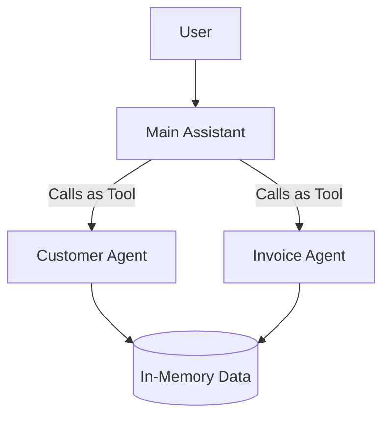

# Multi-Agent Invoice System

A multi-agent system for Customer and Invoice management using `@openai/agents` SDK.

## Architecture

The system uses a **Main Assistant** that orchestrates two specialist agents as tools:

1.  **Main Assistant**: The entry point and orchestrator. It analyzes user requests and delegates tasks to specialist agents.
2.  **Customer Agent**: A specialist tool for managing customer data (create, get, list).
3.  **Invoice Agent**: A specialist tool for managing invoices (create, get, list, update).

The agents share an in-memory database for this demonstration.



## Features

-   **Multi-Agent Orchestration**: The Main Assistant can chain multiple agent calls to complete complex workflows (e.g., "Create a customer and then an invoice").
-   **Specialized Agents**: Each agent focuses on a specific domain, keeping prompts and tools clean.
-   **Natural Language Interface**: Interact with the system using plain English.
-   **Automated Handoffs**: The system automatically determines which agent to call and when.

## Installation

1.  **Install dependencies:**
    ```bash
    npm install
    ```

2.  **Configure Environment:**
    Create a `.env` file in the root directory:
    ```env
    OPENAI_API_KEY=sk-your-api-key-here
    OPENAI_MODEL=gpt-4-turbo-preview
    ```

3.  **Build the project:**
    ```bash
    npm run build
    ```

## Usage

Start the agent system:

```bash
npm run start:agent
```

### Example Workflows

**1. Create a Customer and Invoice in one go:**
> "Create a new invoice with customer name 'Alice', email 'alice@example.com', phone 123. Item 'Consulting', qty 5, price 100."

**2. List all data:**
> "List all customers and invoices."

**3. Multi-turn interaction:**
> User: "Create a customer named Bob."
> Assistant: "Customer Bob created..."
> User: "Create an invoice for him for Web Design, $500."

## Project Structure

-   `src/main-agent.ts`: Entry point. Runs the Main Assistant loop.
-   `src/agents/system.ts`: Defines the agent system and orchestration logic.
-   `src/agents/data.ts`: Shared in-memory data storage.
-   `src/tools/`: Tool definitions for Customer and Invoice domains.

## Technologies

-   [OpenAI Agents SDK](https://github.com/openai/openai-agents-js)
-   Node.js & TypeScript
-   Zod for schema validation