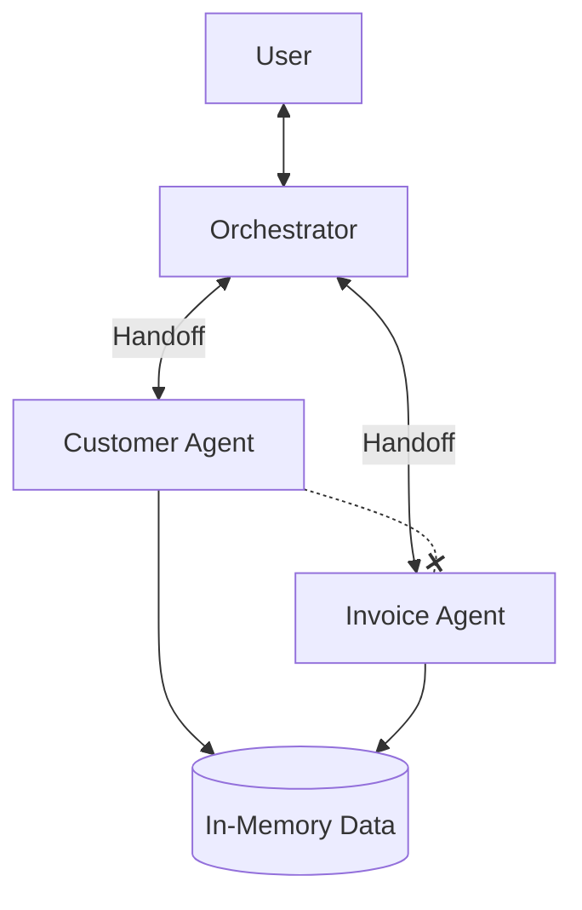

# Multi-Agent Invoice System

A scalable multi-agent system for Customer and Invoice management using `@openai/agents` SDK, implementing a **Hub-and-Spoke** architecture.

## Architecture

The system uses a central **Orchestrator** to manage decoupled specialist agents.

1.  **Orchestrator (Hub)**: The central brain. It receives user requests, maintains workflow state, and routes tasks to specialists.
2.  **Specialist Agents (Spokes)**:
    -   **Customer Agent**: Manages customer data (create, get, list).
    -   **Invoice Agent**: Manages invoices (create, get, list, update).

**Key Design Pattern**: Specialists are "Leaf Nodes". They do not know about each other. They perform their task and strictly handoff back to the Orchestrator.



## Features

-   **Hub-and-Spoke Routing**: Centralized control ensures scalable and predictable workflows.
-   **Decoupled Specialists**: Agents are modular and independent, making it easy to add more (e.g., "Support Agent") without rewiring the whole network.
-   **Robust Handoffs**: Specialists are instructed to explicitly "Return to Base" (Orchestrator) upon task completion.
-   **Natural Language Interface**: Interact with the system using plain English.

## Installation

1.  **Install dependencies:**
    ```bash
    npm install
    ```

2.  **Configure Environment:**
    Create a `.env` file in the root directory:
    ```env
    OPENAI_API_KEY=sk-your-api-key-here
    OPENAI_MODEL=gpt-4-turbo-preview
    ```

3.  **Build the project:**
    ```bash
    npm run build
    ```

## Usage

Start the agent system:

```bash
npm run start:agent
```

### Example Workflows

**1. Complex Multi-Step Workflow:**
> "Create a customer named Bob and then create an invoice for him."
> *   **Flow**: Orchestrator -> Customer Agent (Create Bob) -> Orchestrator -> Invoice Agent (Create Invoice) -> Orchestrator -> User.

**2. Single Task:**
> "List all customers."
> *   **Flow**: Orchestrator -> Customer Agent -> Orchestrator -> User.

## Project Structure

-   `src/main-agent.ts`: Entry point. Runs the Orchestrator loop.
-   `src/agents/system.ts`: Defines the agent system, Orchestrator, and handoff logic.
-   `src/agents/data.ts`: Shared in-memory data storage.
-   `src/tools/`: Tool definitions for Customer and Invoice domains.

## Technologies

-   [OpenAI Agents SDK](https://github.com/openai/openai-agents-js)
-   Node.js & TypeScript
-   Zod for schema validation