# Multi-Agent Invoice System with Large Dataset Support

A production-ready multi-agent system for managing Customers, Invoices, Products, Companies, and Users using `@openai/agents` SDK. Implements a **Hub-and-Spoke** architecture with intelligent search-first approach for handling thousands of records efficiently.

## 🏗️ Architecture

### System Overview

The system uses a central **Orchestrator** (Hub) to manage five decoupled specialist agents (Spokes), each responsible for a specific domain.

```mermaid
graph TD
    User[👤 User] <--> Orchestrator[🎯 Orchestrator<br/>Central Hub]
    
    Orchestrator <-->|Handoff| Customer[👥 Customer Agent<br/>CRUD + Search]
    Orchestrator <-->|Handoff| Invoice[📄 Invoice Agent<br/>CRUD + Search]
    Orchestrator <-->|Handoff| Product[📦 Product Agent<br/>CRUD + Search]
    Orchestrator <-->|Handoff| Company[🏢 Company Agent<br/>CRUD + Search]
    Orchestrator <-->|Handoff| UserAgent[👤 User Agent<br/>CRUD + Search]
    
    Customer --> DB[(📊 In-Memory Store<br/>1000 Customers<br/>500 Products<br/>2000 Invoices<br/>100 Companies<br/>50 Users)]
    Invoice --> DB
    Product --> DB
    Company --> DB
    UserAgent --> DB
    
    style Orchestrator fill:#4CAF50,stroke:#2E7D32,stroke-width:3px,color:#fff
    style Customer fill:#2196F3,stroke:#1565C0,stroke-width:2px,color:#fff
    style Invoice fill:#FF9800,stroke:#E65100,stroke-width:2px,color:#fff
    style Product fill:#9C27B0,stroke:#6A1B9A,stroke-width:2px,color:#fff
    style Company fill:#F44336,stroke:#C62828,stroke-width:2px,color:#fff
    style UserAgent fill:#00BCD4,stroke:#00838F,stroke-width:2px,color:#fff
    style DB fill:#FFC107,stroke:#F57C00,stroke-width:2px
```



> **Note**: Specialist agents are decoupled and do NOT communicate directly with each other. All communication flows through the Orchestrator (Hub-and-Spoke pattern).

### Tool Call Flow Example

**Scenario**: "Create a new invoice for Bop with customer Brian"

```mermaid
sequenceDiagram
    participant U as 👤 User
    participant O as 🎯 Orchestrator
    participant CA as 👥 Customer Agent
    participant IA as 📄 Invoice Agent
    participant DB as 📊 Data Store

    U->>O: "Create invoice for Bop with customer Brian"
    
    Note over O: Routes to Customer domain
    O->>CA: transfer_to_CustomerAgent
    
    Note over CA: SEARCH FIRST!<br/>Extract "Brian" from request
    CA->>DB: list_customers(query: "Brian")
    DB-->>CA: Returns 16 matching customers
    
    Note over CA: Multiple results found<br/>Ask for disambiguation
    CA->>U: "Which Brian? (shows 16 options)"
    
    U->>CA: "use Brian Rivera"
    CA->>O: transfer_to_Orchestrator<br/>(with customer ID: CUST-177)
    
    Note over O: Routes to Invoice domain
    O->>IA: transfer_to_InvoiceAgent
    
    IA->>DB: create_invoice(customerId: CUST-177,<br/>items: [{desc: "Bop", qty: 1, price: 0}])
    DB-->>IA: Invoice created: INV-1764510335174
    
    IA->>O: transfer_to_Orchestrator
    O->>U: "Success! Created invoice for Brian Rivera"
    
    Note over U,DB: Total: 3 tool calls<br/>Tokens: 9,263<br/>Search prevented creating duplicate customer!
```



## ✨ Key Features

### 🎯 Hub-and-Spoke Architecture
- **Centralized Control**: Orchestrator maintains workflow state and routes tasks
- **Decoupled Specialists**: Each agent is independent and modular
- **Scalable Design**: Easy to add new agents without rewiring

### 🔍 Search-First Approach
- **Intelligent Search**: Agents automatically search for existing records before creating new ones
- **Query Validation**: All search tools require non-empty queries
- **Result Limiting**: Maximum 20 results per search to prevent data overload
- **Multi-field Search**: Search across names, emails, IDs, phone numbers, etc.

### 📊 Large Dataset Support
- **1,000 Customers** with realistic data
- **500 Products** across multiple categories
- **2,000 Invoices** with line items
- **100 Companies** with business information
- **50 Users** with different roles

### 🤖 Smart Disambiguation
- **0 results** → Asks if user wants to create new record
- **1 result** → Uses it automatically
- **Multiple results** → Asks user to specify which one

## 🚀 Installation

1. **Install dependencies:**
   ```bash
   npm install
   ```

2. **Configure Environment:**
   Create a `.env` file:
   ```env
   OPENAI_API_KEY=sk-your-api-key-here
   OPENAI_MODEL=gpt-4-turbo-preview
   ```

3. **Generate Mock Data:**
   ```bash
   npm run generate-data
   ```
   This creates 3,650+ records across all entities.

4. **Build the project:**
   ```bash
   npm run build
   ```

## 💻 Usage

### Start the Agent System

```bash
npm run dev
```

### Example Interactions

#### 1. **Search-First Workflow** (Prevents Duplicates)
```
User: "Create invoice for customer Brian"

Agent Flow:
1. 🔍 Searches for "Brian" → Finds 16 customers
2. ❓ Asks: "Which Brian?" (shows all 16)
3. ✅ User selects "Brian Rivera"
4. 📄 Creates invoice with correct customer
```

**Token Usage**: 9,263 tokens (3,341 input + 347 output for search, then 9,145 + 118 for creation)

#### 2. **Multi-Step Complex Workflow**
```
User: "Create customer Bob and invoice for him"

Agent Flow:
1. 👥 Customer Agent creates Bob
2. 🎯 Returns to Orchestrator
3. 📄 Invoice Agent asks for items
4. 👤 User: "what items am I having?"
5. 📦 Product Agent lists available products
6. 📄 Invoice Agent creates invoice with selected items
```

#### 3. **Simple Search Query**
```
User: "Find customers named John"

Agent Flow:
1. 🔍 Searches customers with query "John"
2. 📋 Returns up to 20 matching results
```

## 📁 Project Structure

```
src/
├── main-agent.ts              # Entry point, runs Orchestrator loop
├── agents/
│   ├── system.ts              # Agent definitions & handoff logic
│   └── data.ts                # Shared data access (deprecated)
├── data/
│   ├── store.ts               # In-memory data store (1000s of records)
│   └── mock-data.json         # Generated mock data
├── tools/
│   ├── customer-tools.ts      # Customer CRUD + Search (max 20 results)
│   ├── invoice-tools.ts       # Invoice CRUD + Search (max 20 results)
│   ├── product-tools.ts       # Product CRUD + Search (max 20 results)
│   ├── company-tools.ts       # Company CRUD + Search (max 20 results)
│   └── user-tools.ts          # User CRUD + Search (max 20 results)
scripts/
└── generate-mock-data.ts      # Data generation script
```

## 🔧 Available Scripts

| Script | Command | Description |
|--------|---------|-------------|
| **Generate Data** | `npm run generate-data` | Creates large mock dataset |
| **Build** | `npm run build` | Compiles TypeScript |
| **Start** | `npm run start:agent` | Runs the agent system |
| **Dev** | `npm run dev` | Build + Start |

## 🎨 Design Patterns

### Search-First Pattern

All specialist agents follow this pattern:

```typescript
// ❌ OLD: Direct create (causes duplicates)
User: "Create invoice for Brian"
Agent: create_customer("Brian") // Creates duplicate!

// ✅ NEW: Search first
User: "Create invoice for Brian"
Agent: list_customers(query: "Brian") // Search first
  → If found: Use existing
  → If not found: Ask to create
  → If multiple: Ask which one
```

### Result Limiting

All search tools enforce limits:

```typescript
// Prevents returning 1000s of records
execute: async ({ query }) => {
  // 1. Validate query is not empty
  if (!query || query.trim() === '') {
    return { error: "Query required" };
  }
  
  // 2. Search with filter
  let results = data.filter(item => 
    item.name.includes(query) || 
    item.email.includes(query)
  );
  
  // 3. Limit to max 20
  const totalFound = results.length;
  results = results.slice(0, 20);
  
  console.log(`Found ${totalFound} (returning ${results.length})`);
  return results;
}
```

## 📊 Performance Metrics

Based on real execution data (see `ai_execution_history_data.md`):

| Scenario | Tool Calls | Input Tokens | Output Tokens | Total Tokens |
|----------|------------|--------------|---------------|--------------|
| **Search + Disambiguate** | 2 | 3,341 | 347 | 3,688 |
| **Create after Search** | 3 | 9,145 | 118 | 9,263 |
| **Multi-step Workflow** | 8+ | 4,507 | 136 | 4,643 |

### Search Performance
- **Average search time**: <5ms for 1000 records
- **Max results returned**: 20 items
- **Multi-field matching**: Name, email, phone, ID, etc.

## 🛠️ Technologies

- **[OpenAI Agents SDK](https://github.com/openai/openai-agents-js)** - Multi-agent orchestration
- **Node.js & TypeScript** - Runtime and type safety
- **Zod** - Schema validation
- **In-Memory Store** - Fast data access (Map-based)

## 📝 Agent Instructions Summary

### Specialist Agents
1. **SEARCH BEFORE CREATE/UPDATE** - Always search for existing records first
2. **ACTION OVER TALK** - Execute tools, don't describe actions
3. **PARTIAL FULFILLMENT** - Focus only on your domain
4. **HANDOFF** - Always return to Orchestrator when done
5. **SILENT EXECUTION** - No text output during tool calls

### Orchestrator
1. **DATA SCALE AWARENESS** - System has 1000s of records
2. **AMBIGUITY HANDLING** - Ask clarifying questions when needed
3. **SILENT ROUTING** - Route without narration
4. **WORKFLOW STATE** - Maintain multi-step task context

## 🎯 Real-World Example

See `ai_execution_history_data.md` for detailed execution traces showing:
- ✅ Correct search-first behavior with disambiguation
- ❌ Old behavior (creating duplicates)
- 📊 Token usage and performance metrics
- 🔄 Multi-turn conversations with state management

## 🤝 Contributing

This is a reference implementation demonstrating:
- Multi-agent orchestration patterns
- Search-first data access
- Large dataset handling
- Hub-and-spoke architecture

## 📄 License

MIT